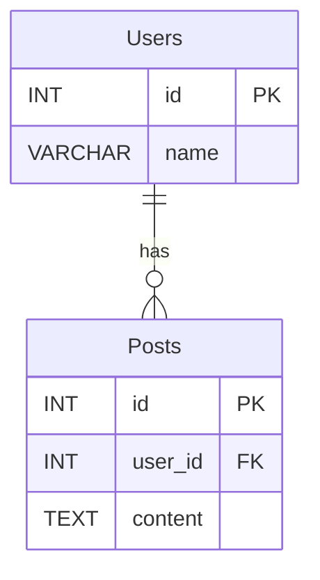

# ERD Editor

Rust + Tauri 기반의 ERD(Entity Relationship Diagram) WYSIWYG 편집기입니다.

## 주요 기능

- ✅ 직관적인 WYSIWYG 엔티티 편집
- ✅ 드래그 앤 드롭으로 엔티티 배치
- ✅ 관계선 그리기 (1:1, 1:N, N:M)
- ✅ 속성 관리 (Primary Key, Foreign Key, 데이터 타입)
- ✅ Markdown 형식으로 내보내기
- ✅ Mermaid 형식으로 내보내기
- ✅ 프로젝트 저장/열기 (JSON 형식)

## 설치 및 실행

### 개발 환경 요구사항

- Node.js 16+
- Rust 1.70+
- Tauri CLI

### 설치

```bash
# 의존성 설치
npm install

# Tauri CLI 설치 (없는 경우)
npm install -g @tauri-apps/cli
```

### 개발 서버 실행

```bash
npm run tauri:dev
```

### 프로덕션 빌드

```bash
npm run tauri:build
```

## 사용법

### 1. 엔티티 생성
- "엔티티 추가" 버튼 클릭 또는 캔버스 더블클릭
- 엔티티 이름 입력
- 속성 추가 (이름, 데이터 타입, 제약조건 설정)

### 2. 관계 생성
- "관계 추가" 버튼 클릭
- From/To 엔티티 선택
- 카디널리티 설정 (1:1, 1:N, N:M)
- 관계 이름 입력

### 3. 편집
- 엔티티 드래그로 위치 조정
- 엔티티 더블클릭으로 편집
- 우클릭으로 컨텍스트 메뉴

### 4. 저장/내보내기
- "저장" - JSON 형식으로 프로젝트 저장
- "Markdown 내보내기" - 테이블 형식 마크다운
- "Mermaid 내보내기" - Mermaid 다이어그램 형식

## 프로젝트 구조

```
erd-editor/
├── src-tauri/           # Rust 백엔드
│   ├── src/
│   │   ├── main.rs      # Tauri 앱 진입점
│   │   ├── commands.rs  # 파일 I/O 명령어
│   │   └── erd.rs       # ERD 데이터 구조
│   └── Cargo.toml
├── src/                 # 프론트엔드
│   ├── main.js          # 메인 애플리케이션
│   ├── components/      # UI 컴포넌트
│   │   ├── Canvas.js    # 캔버스 렌더링
│   │   ├── EntityManager.js  # 엔티티 관리
│   │   └── RelationManager.js # 관계 관리
│   └── utils/
│       └── file-handler.js    # 파일 처리 유틸
└── index.html           # 메인 HTML
```

## 데이터 형식

### 엔티티
```json
{
  "id": "entity_123",
  "name": "Users",
  "x": 100,
  "y": 50,
  "width": 150,
  "height": 120,
  "attributes": [
    {
      "name": "id",
      "data_type": "INT",
      "is_primary_key": true,
      "is_foreign_key": false,
      "is_nullable": false
    }
  ]
}
```

### 관계
```json
{
  "id": "relation_456",
  "from_entity_id": "entity_123",
  "to_entity_id": "entity_789",
  "cardinality": "OneToMany",
  "name": "has"
}
```

## 출력 형식

### Markdown 형식
```markdown
# ERD Diagram

## Entities

### Users
| Attribute | Type | Constraints |
|-----------|------|-------------|
| id | INT | PK, NOT NULL |
| name | VARCHAR |  |

## Relations
- Users (1:N) → Posts : has
```

### Mermaid 형식


## 기여하기

1. Fork the repository
2. Create your feature branch (`git checkout -b feature/amazing-feature`)
3. Commit your changes (`git commit -m 'Add some amazing feature'`)
4. Push to the branch (`git push origin feature/amazing-feature`)
5. Open a Pull Request

## 라이선스

MIT License